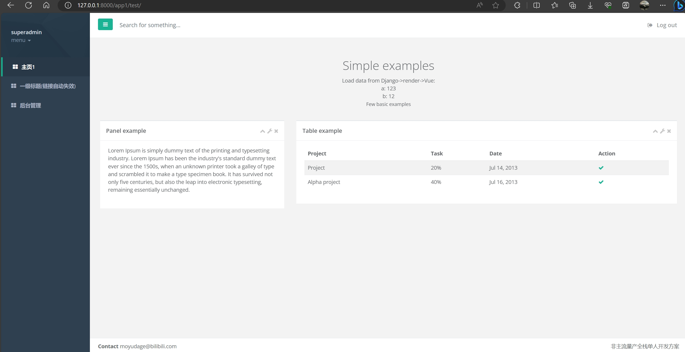
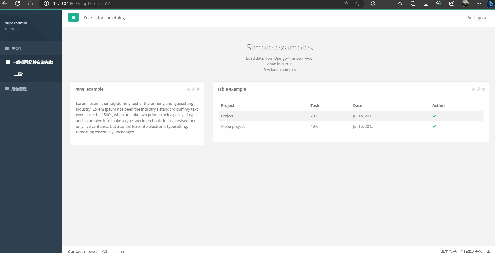
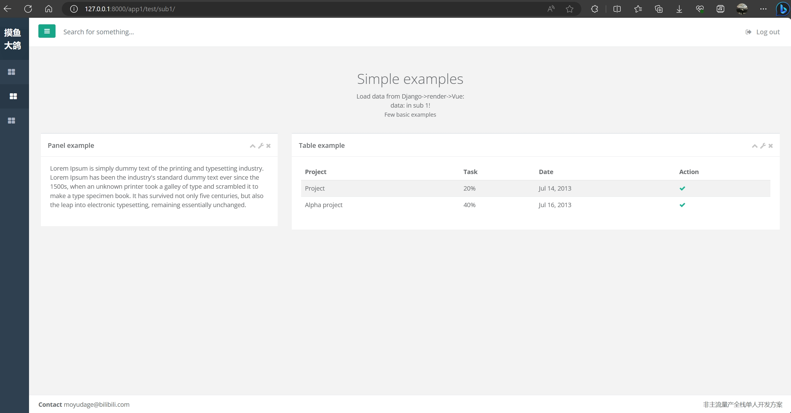
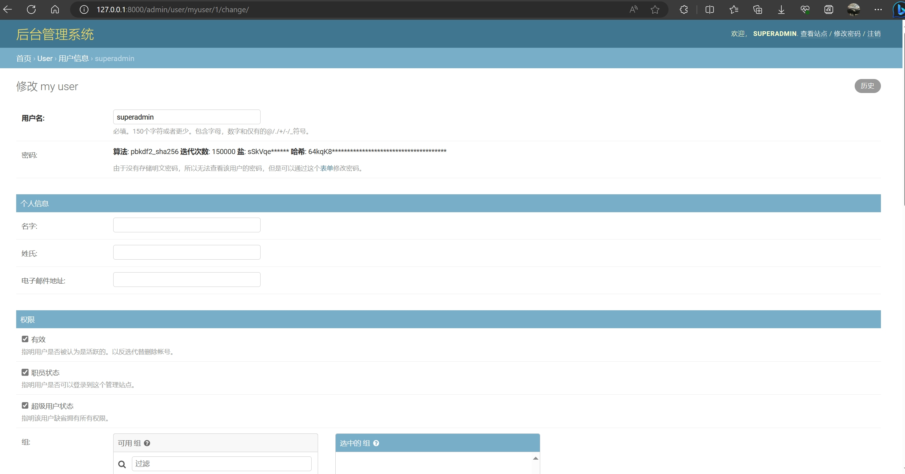
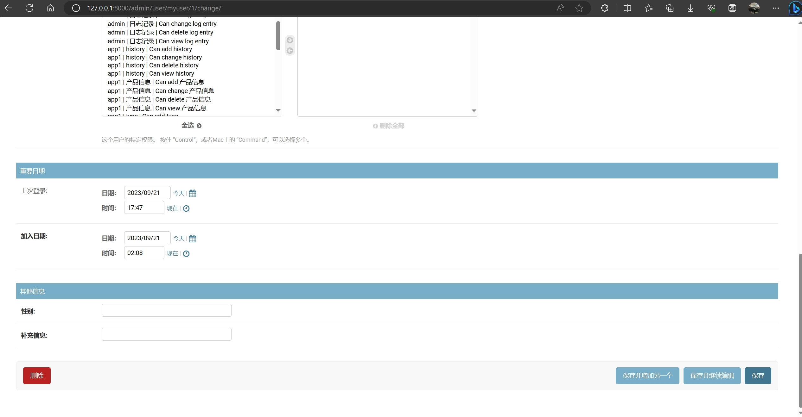

# DRRV全后端小型demo - 不分离式个人快速开发 -- 支持一主多从扩展
基于django模板渲染能力，前端基础为inspinia(bootstrap系)，结合django自带权限管理后台  
提供一个django+vue二次渲染的小网站demo，面向个人全栈量产式开发应用场景，提供一套基础小demo，方便二次开发

## 技术方案
django+django-render+vue.js(非分离编译-模板+动态引入免编译)+sqlite3

## 优点：
1. 适合小型网站快速开发
2. 后端一把梭，render时两次渲染，免去一次ajax向后端要数据的过程，后端所赋即前端所得，自动变量渲染
3. 前端非编译写法，且套用模板，方便多个子页面书写时仅关注内容即可，方便快速增接口
4. 后端render提供html给前端，非前后端分离，在鉴权/缓存等方面有优势，直接复用django自带的认证权限/缓存功能，并使用缓存过滤所有变量
5. 免配置数据库，利用文件类型数据库
6. 不需要npm，不需要nodejs，不需要单独安装前端环境，方便交付后部署环境下修改前端


## 缺点
1. 非主流开发方式，前后端不分离
2. 前端非编译式写法，页面可理解为二次渲染，相比于编译压缩的前端工程，体积更大
3. 无法通过nginx等单独部署前端，项目部署时采用uwsgi/docker部署

## 测试方法
```
cd django1/
python manage.py makemigrations
python manage.py migrate

python manage.py runserver 0.0.0.0:8000 # 即可打开浏览器直接输入ip:8000访问
```

## 部署方法
```
cd docker/
docker-compose build
docker-compose up -d
```

## 页面展示(主站+后台)
其中后台为django默认自带页面，如需美化可一键安装django-simpleui等主题包

<center class="half">





</center>

## 其他说明
项目已经对静态文件规整，兼容debug的开关双模式，在django后端对静态文件路由，uwsgi/(nginx)不需单独配置，(当然如果想另外配置静态文件也可以)。  
通过静态文件路由模式的兼容，极大方便了纯python运行时、uwsgi/docker运行下的调试模式分别开或关的代码兼容。
- 总结一句话，无论用哪种启动方式，都可自由地只改动setting.py中debug=True或False切换运行模式，不需特意处理静态文件路由。
- 另外，如果想额外再次打包静态文件(python manage.py collectstatic)，需要到settings中设置1. debug=True 2. collect_mode=True

# 一主多从扩展
见dnsdbsync.py 我使用的cloudfare进行域名管理和主节点在线判断，使用sshpass等方式进行同步
